# Diagramas UML — Scyther

Diagramas do design em [`../superpowers/specs/2026-11-18-scyther-hackathon-design.md`](../superpowers/specs/2026-11-18-scyther-hackathon-design.md).
A fonte é o Mermaid deste arquivo (o GitHub renderiza direto); as versões em PNG ficam em [`img/`](img/).

A visão em níveis (contexto, contêineres e componentes do worker) está nos [diagramas C4](c4.md).

> Nomes de classes, interfaces e métodos são a **proposta inicial** para orientar a implementação.
> Rotas, filas, estados e tabelas seguem o spec.

| # | Diagrama | Tipo UML |
|---|---|---|
| 1 | [Casos de uso](#1-casos-de-uso) | Casos de uso |
| 2 | [Componentes](#2-componentes) | Componentes |
| 3 | [Implantação na AWS](#3-implantação-na-aws) | Implantação |
| 4 | [Domínio da API](#4-domínio-da-api) | Classes |
| 5 | [Casos de uso, portas e adaptadores da API](#5-casos-de-uso-e-portas-da-api) | Classes |
| 6 | [Worker Go](#6-worker-go) | Classes |
| 7 | [Estados do vídeo](#7-estados-do-vídeo) | Máquina de estados |
| 8 | [Fluxo principal](#8-fluxo-principal) | Sequência |
| 9 | [Progresso em tempo real (SSE)](#9-progresso-em-tempo-real-sse) | Sequência |
| 10 | [Falha, retry e DLQ](#10-falha-retry-e-dlq) | Sequência |
| 11 | [Topologia do RabbitMQ](#11-topologia-do-rabbitmq) | Componentes |
| 12 | [Modelo de dados](#12-modelo-de-dados) | Entidade-relacionamento |

## 1. Casos de uso

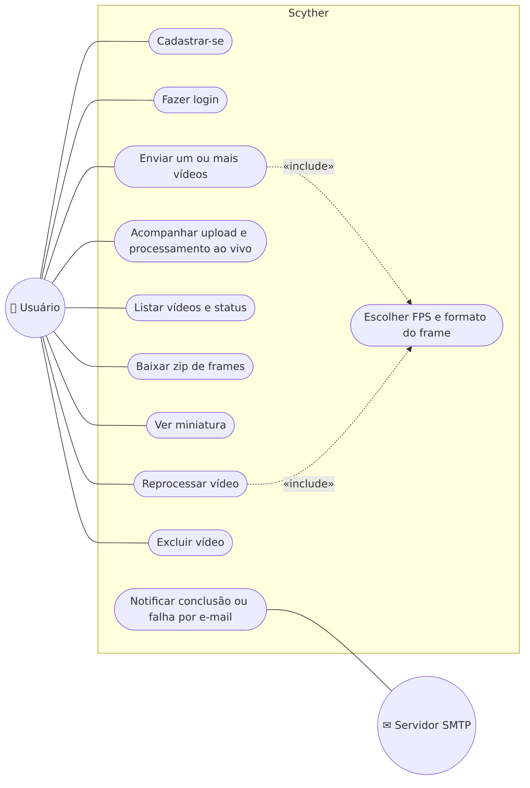

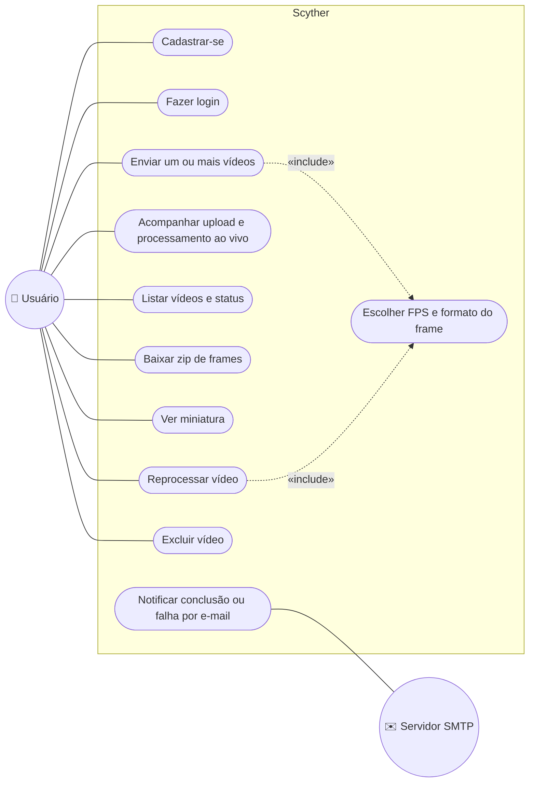
```mermaid
flowchart LR
    user(("👤 Usuário"))
    mail(("✉️ Servidor SMTP"))

    subgraph scyther["Scyther"]
        direction TB
        uc1(["Cadastrar-se"])
        uc2(["Fazer login"])
        uc3(["Enviar um ou mais vídeos"])
        uc4(["Escolher FPS e formato do frame"])
        uc5(["Acompanhar upload e processamento ao vivo"])
        uc6(["Listar vídeos e status"])
        uc7(["Baixar zip de frames"])
        uc8(["Ver miniatura"])
        uc9(["Reprocessar vídeo"])
        uc10(["Excluir vídeo"])
        uc11(["Notificar conclusão ou falha por e-mail"])
    end

    user --- uc1
    user --- uc2
    user --- uc3
    user --- uc5
    user --- uc6
    user --- uc7
    user --- uc8
    user --- uc9
    user --- uc10
    uc3 -. "«include»" .-> uc4
    uc9 -. "«include»" .-> uc4
    uc11 --- mail
```

## 2. Componentes

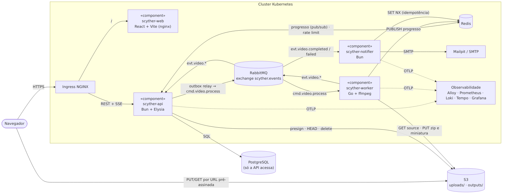

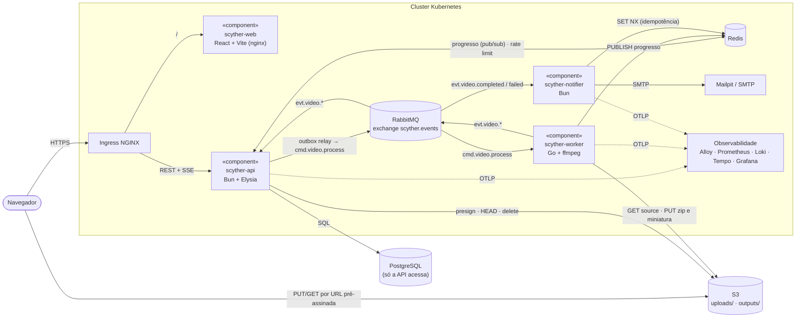
```mermaid
flowchart LR
    browser(["Navegador"])

    subgraph k8s["Cluster Kubernetes"]
        ingress["Ingress NGINX"]
        web["«component»<br/>scyther-web<br/>React + Vite (nginx)"]
        api["«component»<br/>scyther-api<br/>Bun + Elysia"]
        worker["«component»<br/>scyther-worker<br/>Go + ffmpeg"]
        notifier["«component»<br/>scyther-notifier<br/>Bun"]
        rabbit[("RabbitMQ<br/>exchange scyther.events")]
        redis[("Redis")]
        smtp["Mailpit / SMTP"]
        obs["Observabilidade<br/>Alloy · Prometheus · Loki · Tempo · Grafana"]
    end

    pg[("PostgreSQL<br/>(só a API acessa)")]
    s3[("S3<br/>uploads/ · outputs/")]

    browser -->|HTTPS| ingress
    ingress -->|/| web
    ingress -->|REST + SSE| api
    browser -->|"PUT/GET por URL pré-assinada"| s3

    api -->|SQL| pg
    api -->|"presign · HEAD · delete"| s3
    api -->|"outbox relay → cmd.video.process"| rabbit
    rabbit -->|"evt.video.*"| api
    api <-->|"progresso (pub/sub) · rate limit"| redis

    rabbit -->|cmd.video.process| worker
    worker -->|"evt.video.*"| rabbit
    worker -->|"GET source · PUT zip e miniatura"| s3
    worker -->|"PUBLISH progresso"| redis

    rabbit -->|"evt.video.completed / failed"| notifier
    notifier -->|"SET NX (idempotência)"| redis
    notifier -->|SMTP| smtp

    api -.->|OTLP| obs
    worker -.->|OTLP| obs
    notifier -.->|OTLP| obs
```

## 3. Implantação na AWS

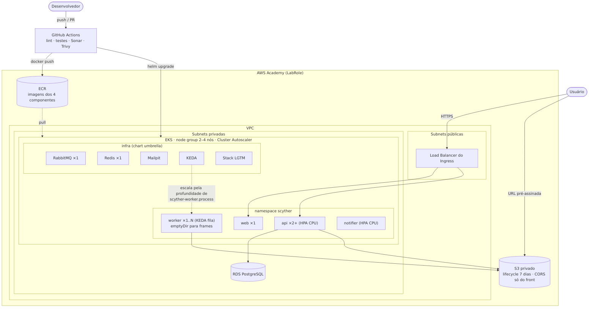

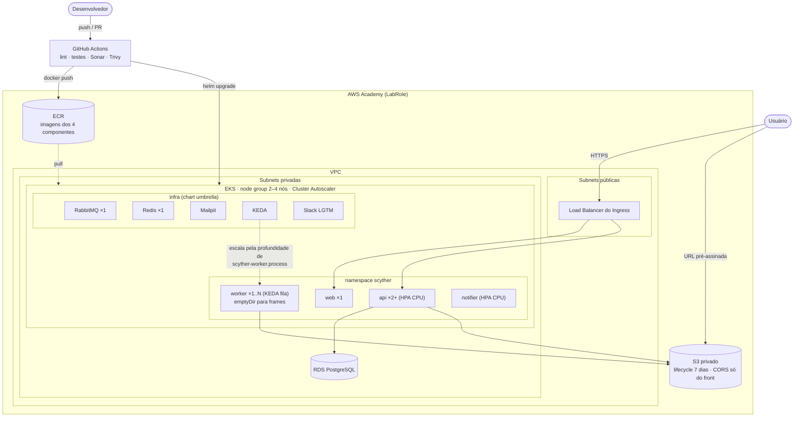
```mermaid
flowchart TB
    dev(["Desenvolvedor"])
    gh["GitHub Actions<br/>lint · testes · Sonar · Trivy"]
    user(["Usuário"])

    subgraph aws["AWS Academy (LabRole)"]
        ecr[("ECR<br/>imagens dos 4 componentes")]
        s3[("S3 privado<br/>lifecycle 7 dias · CORS só do front")]

        subgraph vpc["VPC"]
            subgraph pub["Subnets públicas"]
                lb["Load Balancer do Ingress"]
            end
            subgraph priv["Subnets privadas"]
                rds[("RDS PostgreSQL")]
                subgraph eks["EKS · node group 2–4 nós · Cluster Autoscaler"]
                    subgraph ns_app["namespace scyther"]
                        p_web["web ×1"]
                        p_api["api ×2+ (HPA CPU)"]
                        p_worker["worker ×1..N (KEDA fila)<br/>emptyDir para frames"]
                        p_not["notifier (HPA CPU)"]
                    end
                    subgraph ns_infra["infra (chart umbrella)"]
                        p_rmq["RabbitMQ ×1"]
                        p_redis["Redis ×1"]
                        p_mail["Mailpit"]
                        p_keda["KEDA"]
                        p_obs["Stack LGTM"]
                    end
                end
            end
        end
    end

    dev -->|push / PR| gh
    gh -->|docker push| ecr
    gh -->|helm upgrade| eks
    ecr -.->|pull| eks
    user -->|HTTPS| lb --> p_web & p_api
    user -->|URL pré-assinada| s3
    p_api --> rds
    p_api & p_worker --> s3
    p_keda -.->|"escala pela profundidade de<br/>scyther-worker.process"| p_worker
```

## 4. Domínio da API

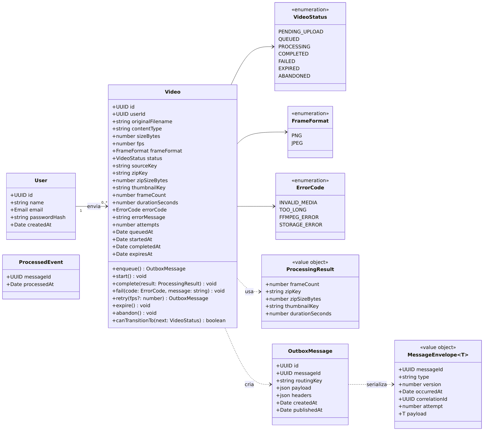

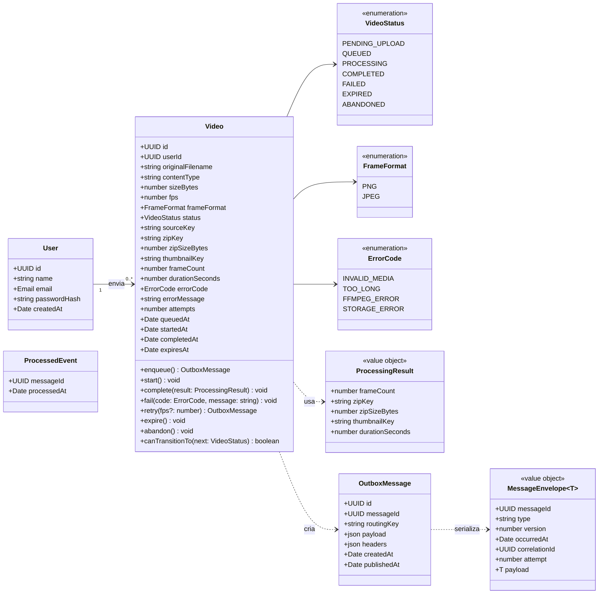
```mermaid
classDiagram
    direction LR

    class User {
        +UUID id
        +string name
        +Email email
        +string passwordHash
        +Date createdAt
    }

    class Video {
        +UUID id
        +UUID userId
        +string originalFilename
        +string contentType
        +number sizeBytes
        +number fps
        +FrameFormat frameFormat
        +VideoStatus status
        +string sourceKey
        +string zipKey
        +number zipSizeBytes
        +string thumbnailKey
        +number frameCount
        +number durationSeconds
        +ErrorCode errorCode
        +string errorMessage
        +number attempts
        +Date queuedAt
        +Date startedAt
        +Date completedAt
        +Date expiresAt
        +enqueue() OutboxMessage
        +start() void
        +complete(result: ProcessingResult) void
        +fail(code: ErrorCode, message: string) void
        +retry(fps?: number) OutboxMessage
        +expire() void
        +abandon() void
        +canTransitionTo(next: VideoStatus) boolean
    }

    class VideoStatus {
        <<enumeration>>
        PENDING_UPLOAD
        QUEUED
        PROCESSING
        COMPLETED
        FAILED
        EXPIRED
        ABANDONED
    }

    class FrameFormat {
        <<enumeration>>
        PNG
        JPEG
    }

    class ErrorCode {
        <<enumeration>>
        INVALID_MEDIA
        TOO_LONG
        FFMPEG_ERROR
        STORAGE_ERROR
    }

    class ProcessingResult {
        <<value object>>
        +number frameCount
        +string zipKey
        +number zipSizeBytes
        +string thumbnailKey
        +number durationSeconds
    }

    class OutboxMessage {
        +UUID id
        +UUID messageId
        +string routingKey
        +json payload
        +json headers
        +Date createdAt
        +Date publishedAt
    }

    class ProcessedEvent {
        +UUID messageId
        +Date processedAt
    }

    class MessageEnvelope~T~ {
        <<value object>>
        +UUID messageId
        +string type
        +number version
        +Date occurredAt
        +UUID correlationId
        +number attempt
        +T payload
    }

    User "1" --> "0..*" Video : envia
    Video --> VideoStatus
    Video --> FrameFormat
    Video --> ErrorCode
    Video ..> ProcessingResult : usa
    Video ..> OutboxMessage : cria
    OutboxMessage ..> MessageEnvelope : serializa
```

## 5. Casos de uso e portas da API

Clean Architecture: casos de uso dependem só de portas (interfaces); adaptadores ficam na
borda e implementam as portas.

### 5a. Casos de uso → portas

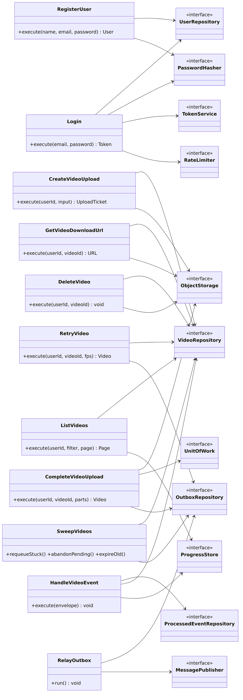

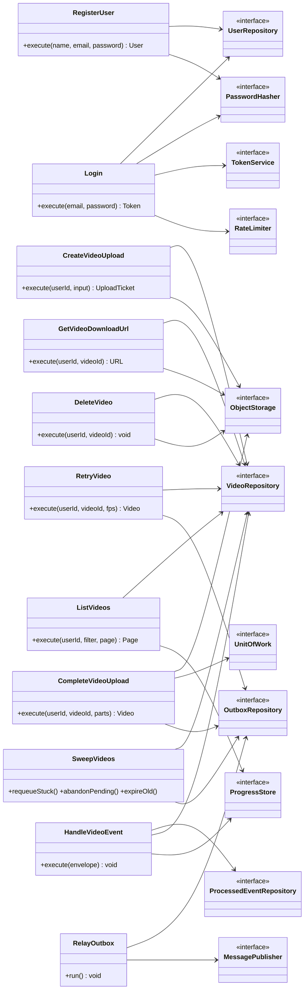
```mermaid
classDiagram
    direction LR

    class RegisterUser { +execute(name, email, password) User }
    class Login { +execute(email, password) Token }
    class CreateVideoUpload { +execute(userId, input) UploadTicket }
    class CompleteVideoUpload { +execute(userId, videoId, parts) Video }
    class ListVideos { +execute(userId, filter, page) Page }
    class GetVideoDownloadUrl { +execute(userId, videoId) URL }
    class RetryVideo { +execute(userId, videoId, fps) Video }
    class DeleteVideo { +execute(userId, videoId) void }
    class HandleVideoEvent { +execute(envelope) void }
    class RelayOutbox { +run() void }
    class SweepVideos { +requeueStuck() +abandonPending() +expireOld() }

    class UserRepository { <<interface>> }
    class PasswordHasher { <<interface>> }
    class TokenService { <<interface>> }
    class RateLimiter { <<interface>> }
    class VideoRepository { <<interface>> }
    class ObjectStorage { <<interface>> }
    class UnitOfWork { <<interface>> }
    class OutboxRepository { <<interface>> }
    class ProcessedEventRepository { <<interface>> }
    class ProgressStore { <<interface>> }
    class MessagePublisher { <<interface>> }

    RegisterUser --> UserRepository
    RegisterUser --> PasswordHasher
    Login --> UserRepository
    Login --> PasswordHasher
    Login --> TokenService
    Login --> RateLimiter
    CreateVideoUpload --> VideoRepository
    CreateVideoUpload --> ObjectStorage
    CompleteVideoUpload --> ObjectStorage
    CompleteVideoUpload --> UnitOfWork
    CompleteVideoUpload --> OutboxRepository
    ListVideos --> VideoRepository
    ListVideos --> ProgressStore
    GetVideoDownloadUrl --> VideoRepository
    GetVideoDownloadUrl --> ObjectStorage
    RetryVideo --> VideoRepository
    RetryVideo --> OutboxRepository
    DeleteVideo --> VideoRepository
    DeleteVideo --> ObjectStorage
    HandleVideoEvent --> ProcessedEventRepository
    HandleVideoEvent --> VideoRepository
    HandleVideoEvent --> ProgressStore
    RelayOutbox --> OutboxRepository
    RelayOutbox --> MessagePublisher
    SweepVideos --> VideoRepository
    SweepVideos --> OutboxRepository
```

### 5b. Portas ← adaptadores

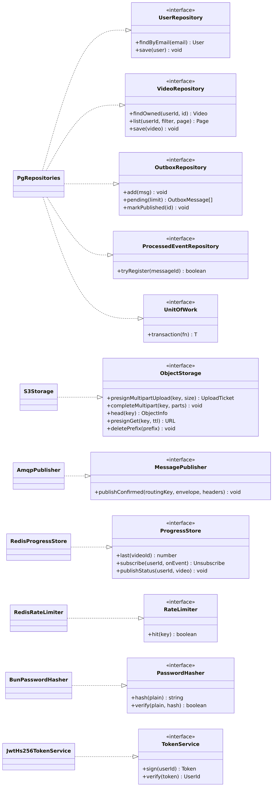

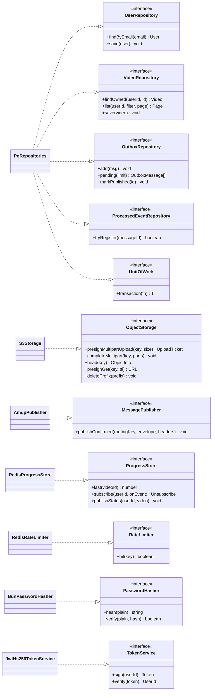
```mermaid
classDiagram
    direction LR

    class UserRepository {
        <<interface>>
        +findByEmail(email) User
        +save(user) void
    }
    class VideoRepository {
        <<interface>>
        +findOwned(userId, id) Video
        +list(userId, filter, page) Page
        +save(video) void
    }
    class OutboxRepository {
        <<interface>>
        +add(msg) void
        +pending(limit) OutboxMessage[]
        +markPublished(id) void
    }
    class ProcessedEventRepository {
        <<interface>>
        +tryRegister(messageId) boolean
    }
    class UnitOfWork {
        <<interface>>
        +transaction(fn) T
    }
    class ObjectStorage {
        <<interface>>
        +presignMultipartUpload(key, size) UploadTicket
        +completeMultipart(key, parts) void
        +head(key) ObjectInfo
        +presignGet(key, ttl) URL
        +deletePrefix(prefix) void
    }
    class MessagePublisher {
        <<interface>>
        +publishConfirmed(routingKey, envelope, headers) void
    }
    class ProgressStore {
        <<interface>>
        +last(videoId) number
        +subscribe(userId, onEvent) Unsubscribe
        +publishStatus(userId, video) void
    }
    class RateLimiter {
        <<interface>>
        +hit(key) boolean
    }
    class PasswordHasher {
        <<interface>>
        +hash(plain) string
        +verify(plain, hash) boolean
    }
    class TokenService {
        <<interface>>
        +sign(userId) Token
        +verify(token) UserId
    }

    PgRepositories ..|> UserRepository
    PgRepositories ..|> VideoRepository
    PgRepositories ..|> OutboxRepository
    PgRepositories ..|> ProcessedEventRepository
    PgRepositories ..|> UnitOfWork
    S3Storage ..|> ObjectStorage
    AmqpPublisher ..|> MessagePublisher
    RedisProgressStore ..|> ProgressStore
    RedisRateLimiter ..|> RateLimiter
    BunPasswordHasher ..|> PasswordHasher
    JwtHs256TokenService ..|> TokenService
```

Adaptadores de entrada: `ElysiaRoutes` (REST + SSE) chama os casos de uso de usuário e vídeo;
`AmqpInboxConsumer` chama `HandleVideoEvent`; jobs agendados chamam `RelayOutbox` e
`SweepVideos`.

## 6. Worker Go

Hexagonal leve: `domain`, `ports`, `adapters`, `cmd/worker`.

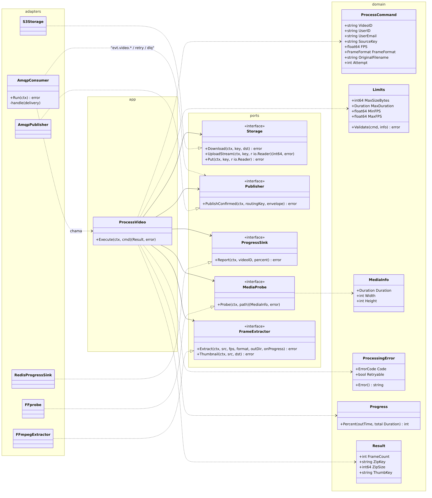

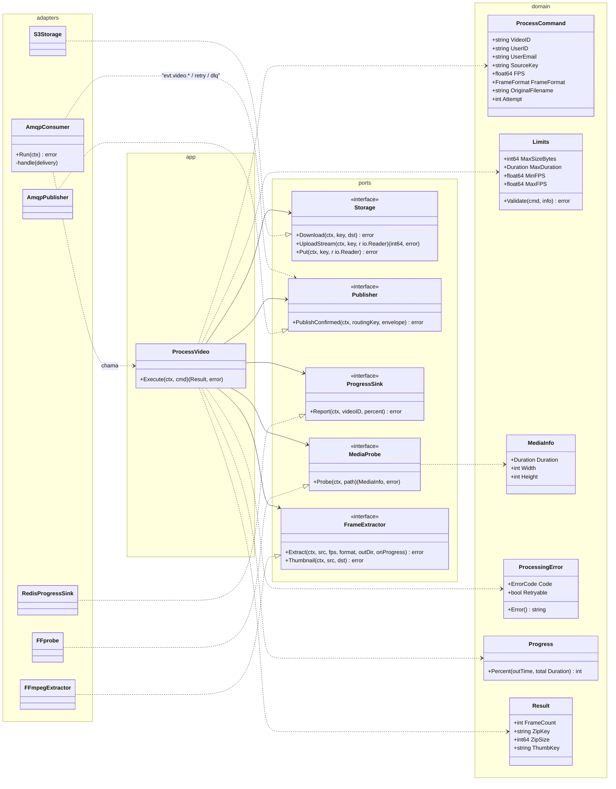
```mermaid
classDiagram
    direction LR

    namespace domain {
        class ProcessCommand {
            +string VideoID
            +string UserID
            +string UserEmail
            +string SourceKey
            +float64 FPS
            +FrameFormat FrameFormat
            +string OriginalFilename
            +int Attempt
        }
        class Limits {
            +int64 MaxSizeBytes
            +Duration MaxDuration
            +float64 MinFPS
            +float64 MaxFPS
            +Validate(cmd, info) error
        }
        class MediaInfo {
            +Duration Duration
            +int Width
            +int Height
        }
        class ProcessingError {
            +ErrorCode Code
            +bool Retryable
            +Error() string
        }
        class Progress {
            +Percent(outTime, total Duration) int
        }
        class Result {
            +int FrameCount
            +string ZipKey
            +int64 ZipSize
            +string ThumbKey
        }
    }

    namespace app {
        class ProcessVideo {
            +Execute(ctx, cmd) (Result, error)
        }
    }

    namespace ports {
        class Storage {
            <<interface>>
            +Download(ctx, key, dst) error
            +UploadStream(ctx, key, r io.Reader) (int64, error)
            +Put(ctx, key, r io.Reader) error
        }
        class Publisher {
            <<interface>>
            +PublishConfirmed(ctx, routingKey, envelope) error
        }
        class ProgressSink {
            <<interface>>
            +Report(ctx, videoID, percent) error
        }
        class MediaProbe {
            <<interface>>
            +Probe(ctx, path) (MediaInfo, error)
        }
        class FrameExtractor {
            <<interface>>
            +Extract(ctx, src, fps, format, outDir, onProgress) error
            +Thumbnail(ctx, src, dst) error
        }
    }

    namespace adapters {
        class AmqpConsumer {
            +Run(ctx) error
            -handle(delivery)
        }
        class S3Storage
        class AmqpPublisher
        class RedisProgressSink
        class FFprobe
        class FFmpegExtractor
    }

    AmqpConsumer ..> ProcessVideo : chama
    AmqpConsumer ..> Publisher : "evt.video.* / retry / dlq"
    ProcessVideo --> Storage
    ProcessVideo --> Publisher
    ProcessVideo --> ProgressSink
    ProcessVideo --> MediaProbe
    ProcessVideo --> FrameExtractor
    ProcessVideo ..> Limits
    ProcessVideo ..> Progress
    ProcessVideo ..> ProcessCommand
    ProcessVideo ..> Result
    ProcessVideo ..> ProcessingError
    MediaProbe ..> MediaInfo

    S3Storage ..|> Storage
    AmqpPublisher ..|> Publisher
    RedisProgressSink ..|> ProgressSink
    FFprobe ..|> MediaProbe
    FFmpegExtractor ..|> FrameExtractor
```

## 7. Estados do vídeo

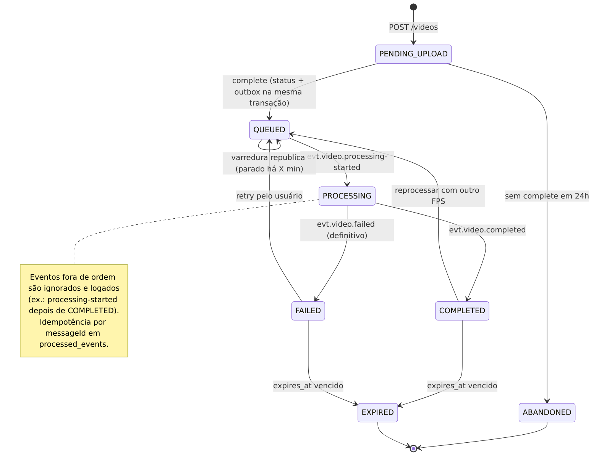

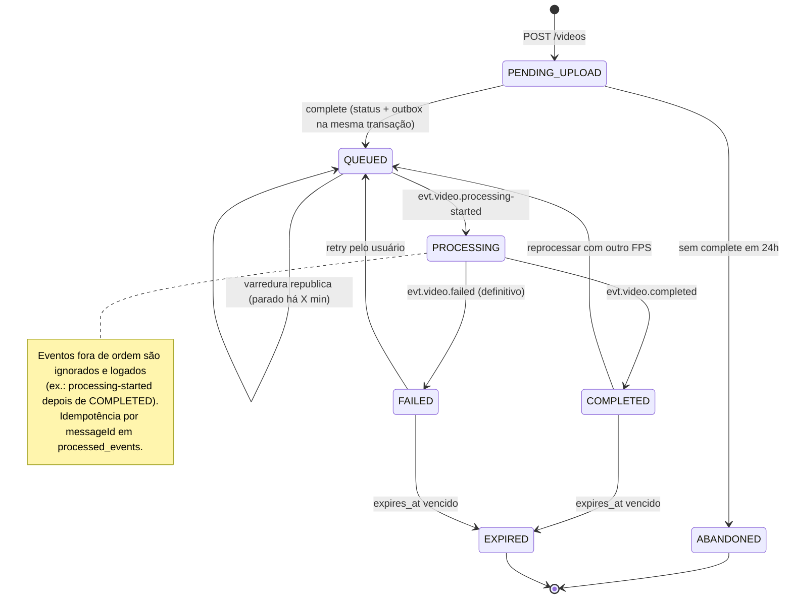
```mermaid
stateDiagram-v2
    [*] --> PENDING_UPLOAD : POST /videos
    PENDING_UPLOAD --> QUEUED : complete (status + outbox na mesma transação)
    PENDING_UPLOAD --> ABANDONED : sem complete em 24h
    QUEUED --> PROCESSING : evt.video.processing-started
    QUEUED --> QUEUED : varredura republica (parado há X min)
    PROCESSING --> COMPLETED : evt.video.completed
    PROCESSING --> FAILED : evt.video.failed (definitivo)
    FAILED --> QUEUED : retry pelo usuário
    COMPLETED --> QUEUED : reprocessar com outro FPS
    COMPLETED --> EXPIRED : expires_at vencido
    FAILED --> EXPIRED : expires_at vencido
    ABANDONED --> [*]
    EXPIRED --> [*]

    note right of PROCESSING
        Eventos fora de ordem são ignorados e logados
        (ex.: processing-started depois de COMPLETED).
        Idempotência por messageId em processed_events.
    end note
```

## 8. Fluxo principal

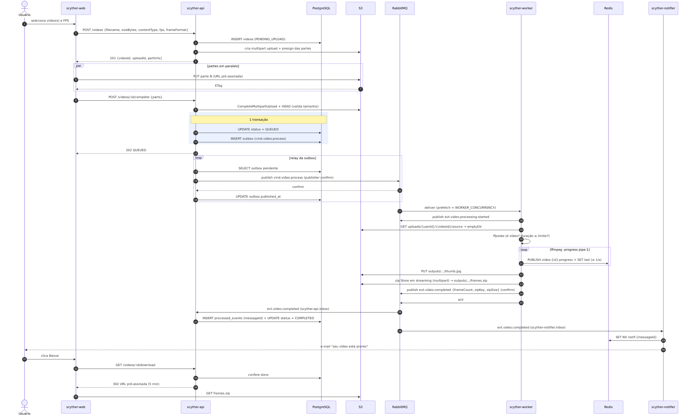

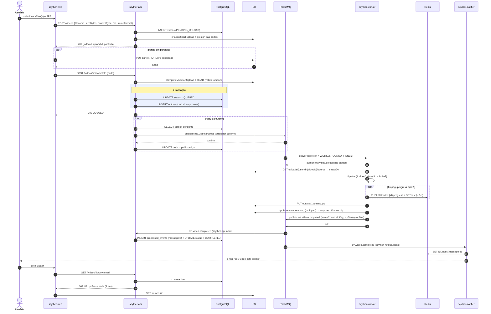
```mermaid
sequenceDiagram
    autonumber
    actor U as Usuário
    participant W as scyther-web
    participant A as scyther-api
    participant DB as PostgreSQL
    participant S3 as S3
    participant MQ as RabbitMQ
    participant WK as scyther-worker
    participant R as Redis
    participant N as scyther-notifier

    U->>W: seleciona vídeo(s) e FPS
    W->>A: POST /videos {filename, sizeBytes, contentType, fps, frameFormat}
    A->>DB: INSERT videos (PENDING_UPLOAD)
    A->>S3: cria multipart upload + presign das partes
    A-->>W: 201 {videoId, uploadId, partUrls}
    par partes em paralelo
        W->>S3: PUT parte N (URL pré-assinada)
        S3-->>W: ETag
    end
    W->>A: POST /videos/:id/complete {parts}
    A->>S3: CompleteMultipartUpload + HEAD (valida tamanho)
    rect rgba(120,160,255,0.15)
        Note over A,DB: 1 transação
        A->>DB: UPDATE status = QUEUED
        A->>DB: INSERT outbox (cmd.video.process)
    end
    A-->>W: 202 QUEUED

    loop relay da outbox
        A->>DB: SELECT outbox pendente
        A->>MQ: publish cmd.video.process (publisher confirm)
        MQ-->>A: confirm
        A->>DB: UPDATE outbox.published_at
    end

    MQ->>WK: deliver (prefetch = WORKER_CONCURRENCY)
    WK->>MQ: publish evt.video.processing-started
    WK->>S3: GET uploads/{userId}/{videoId}/source → emptyDir
    WK->>WK: ffprobe (é vídeo? duração ≤ limite?)
    loop ffmpeg -progress pipe:1
        WK->>R: PUBLISH video:{id}:progress + SET last (≤ 1/s)
    end
    WK->>S3: PUT outputs/.../thumb.jpg
    WK->>S3: zip Store em streaming (multipart) → outputs/.../frames.zip
    WK->>MQ: publish evt.video.completed {frameCount, zipKey, zipSize} (confirm)
    WK->>MQ: ack

    MQ->>A: evt.video.completed (scyther-api.inbox)
    A->>DB: INSERT processed_events (messageId) + UPDATE status = COMPLETED
    MQ->>N: evt.video.completed (scyther-notifier.inbox)
    N->>R: SET NX notif:{messageId}
    N-->>U: e-mail "seu vídeo está pronto"

    U->>W: clica Baixar
    W->>A: GET /videos/:id/download
    A->>DB: confere dono
    A-->>W: 302 URL pré-assinada (5 min)
    W->>S3: GET frames.zip
```

## 9. Progresso em tempo real (SSE)

Qualquer réplica da API atende o SSE, porque o progresso e as mudanças de status passam pelo
Redis pub/sub.

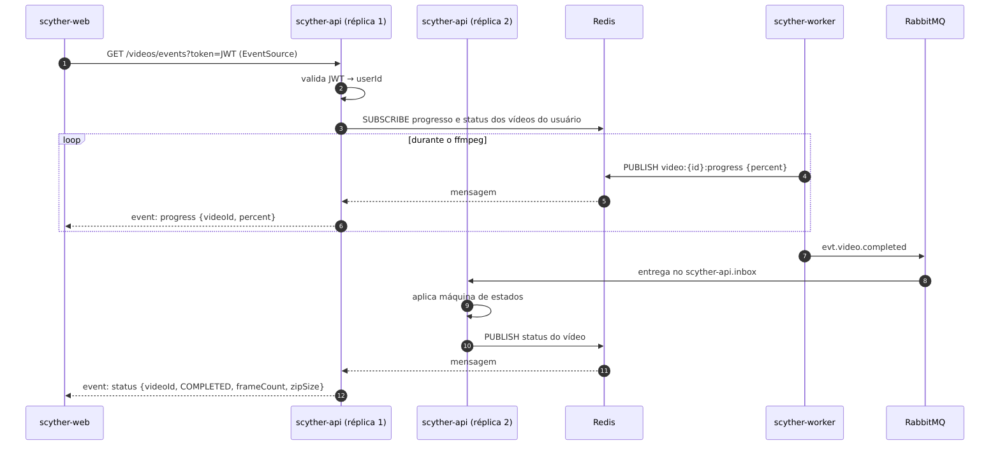

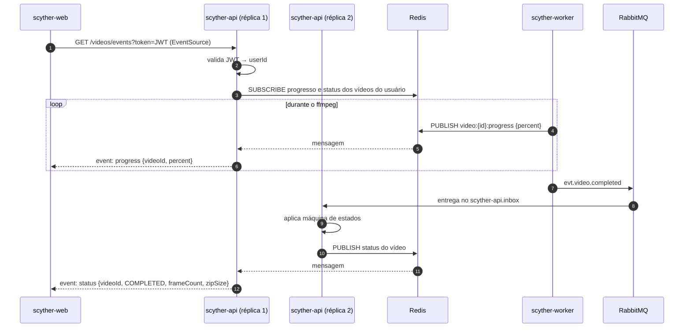
```mermaid
sequenceDiagram
    autonumber
    participant W as scyther-web
    participant A1 as scyther-api (réplica 1)
    participant A2 as scyther-api (réplica 2)
    participant R as Redis
    participant WK as scyther-worker
    participant MQ as RabbitMQ

    W->>A1: GET /videos/events?token=JWT (EventSource)
    A1->>A1: valida JWT → userId
    A1->>R: SUBSCRIBE progresso e status dos vídeos do usuário
    loop durante o ffmpeg
        WK->>R: PUBLISH video:{id}:progress {percent}
        R-->>A1: mensagem
        A1-->>W: event: progress {videoId, percent}
    end
    WK->>MQ: evt.video.completed
    MQ->>A2: entrega no scyther-api.inbox
    A2->>A2: aplica máquina de estados
    A2->>R: PUBLISH status do vídeo
    R-->>A1: mensagem
    A1-->>W: event: status {videoId, COMPLETED, frameCount, zipSize}
```

## 10. Falha, retry e DLQ

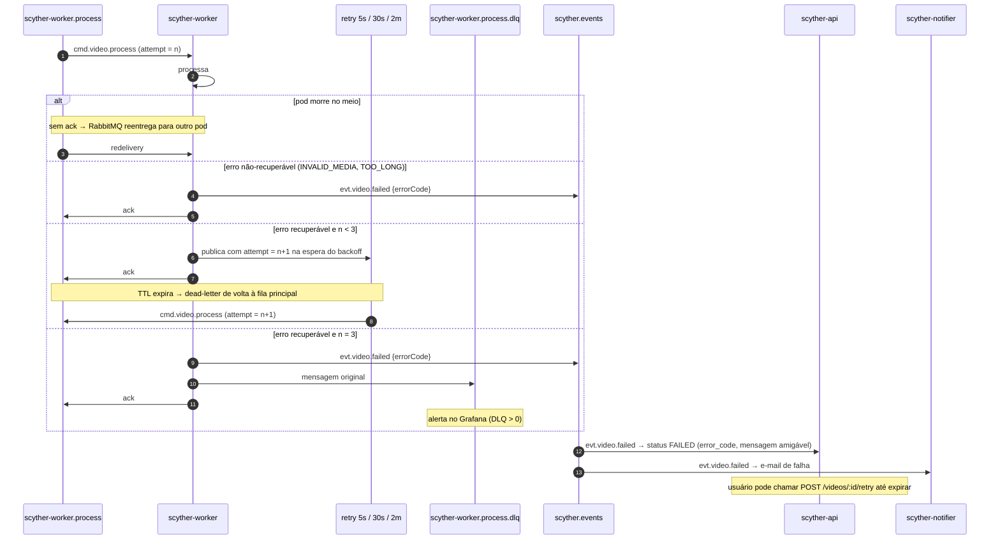
```mermaid
sequenceDiagram
    autonumber
    participant MQ as scyther-worker.process
    participant WK as scyther-worker
    participant RQ as retry 5s / 30s / 2m
    participant DLQ as scyther-worker.process.dlq
    participant EX as scyther.events
    participant A as scyther-api
    participant N as scyther-notifier

    MQ->>WK: cmd.video.process (attempt = n)
    WK->>WK: processa

    alt pod morre no meio
        Note over MQ,WK: sem ack → RabbitMQ reentrega para outro pod
        MQ->>WK: redelivery
    else erro não-recuperável (INVALID_MEDIA, TOO_LONG)
        WK->>EX: evt.video.failed {errorCode}
        WK->>MQ: ack
    else erro recuperável e n < 3
        WK->>RQ: publica com attempt = n+1 na espera do backoff
        WK->>MQ: ack
        Note over RQ,MQ: TTL expira → dead-letter de volta à fila principal
        RQ->>MQ: cmd.video.process (attempt = n+1)
    else erro recuperável e n = 3
        WK->>EX: evt.video.failed {errorCode}
        WK->>DLQ: mensagem original
        WK->>MQ: ack
        Note over DLQ: alerta no Grafana (DLQ > 0)
    end

    EX->>A: evt.video.failed → status FAILED (error_code, mensagem amigável)
    EX->>N: evt.video.failed → e-mail de falha
    Note over A: usuário pode chamar POST /videos/:id/retry até expirar
```

## 11. Topologia do RabbitMQ

Todas as filas são **quorum queues** duráveis. Envelope: `messageId`, `type`, `version`,
`occurredAt`, `correlationId` (= `videoId`), `attempt`, `payload`; header `traceparent`.

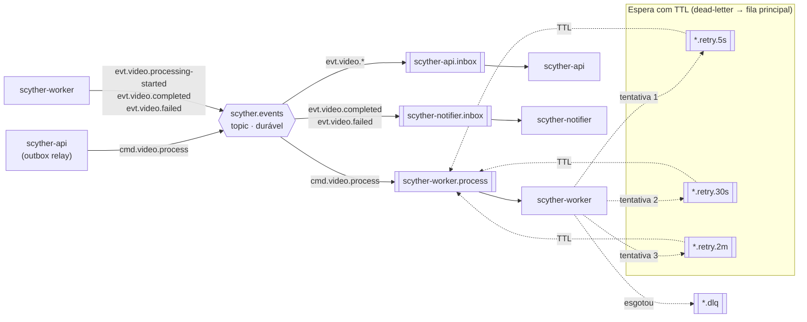
```mermaid
flowchart LR
    api_out["scyther-api<br/>(outbox relay)"]
    worker_out["scyther-worker"]

    ex{{"scyther.events<br/>topic · durável"}}

    q_proc[["scyther-worker.process"]]
    q_api[["scyther-api.inbox"]]
    q_not[["scyther-notifier.inbox"]]

    subgraph retry["Espera com TTL (dead-letter → fila principal)"]
        r5[["*.retry.5s"]]
        r30[["*.retry.30s"]]
        r2m[["*.retry.2m"]]
    end
    dlq[["*.dlq"]]

    worker_in["scyther-worker"]
    api_in["scyther-api"]
    not_in["scyther-notifier"]

    api_out -->|cmd.video.process| ex
    worker_out -->|"evt.video.processing-started<br/>evt.video.completed<br/>evt.video.failed"| ex

    ex -->|cmd.video.process| q_proc
    ex -->|"evt.video.*"| q_api
    ex -->|"evt.video.completed<br/>evt.video.failed"| q_not

    q_proc --> worker_in
    q_api --> api_in
    q_not --> not_in

    worker_in -.->|"tentativa 1"| r5
    worker_in -.->|"tentativa 2"| r30
    worker_in -.->|"tentativa 3"| r2m
    r5 & r30 & r2m -.->|TTL| q_proc
    worker_in -.->|"esgotou"| dlq
```

## 12. Modelo de dados

PostgreSQL, acessado só pela `scyther-api`. As migrations são o script de criação do banco.

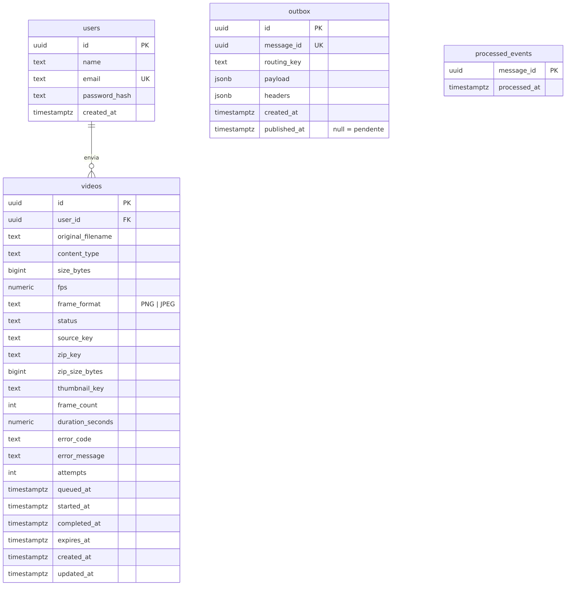

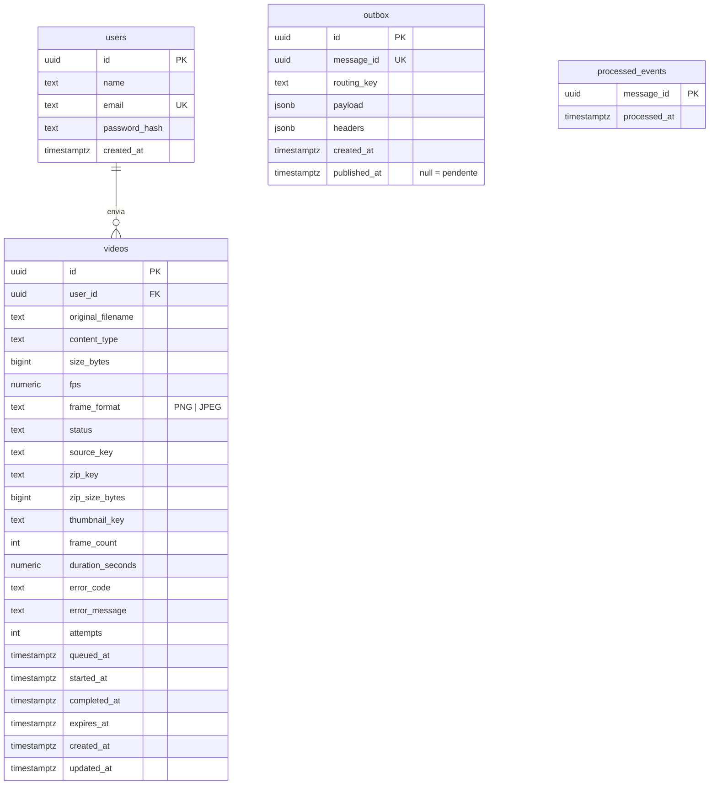
```mermaid
erDiagram
    users ||--o{ videos : "envia"

    users {
        uuid id PK
        text name
        text email UK
        text password_hash
        timestamptz created_at
    }

    videos {
        uuid id PK
        uuid user_id FK
        text original_filename
        text content_type
        bigint size_bytes
        numeric fps
        text frame_format "PNG | JPEG"
        text status
        text source_key
        text zip_key
        bigint zip_size_bytes
        text thumbnail_key
        int frame_count
        numeric duration_seconds
        text error_code
        text error_message
        int attempts
        timestamptz queued_at
        timestamptz started_at
        timestamptz completed_at
        timestamptz expires_at
        timestamptz created_at
        timestamptz updated_at
    }

    outbox {
        uuid id PK
        uuid message_id UK
        text routing_key
        jsonb payload
        jsonb headers
        timestamptz created_at
        timestamptz published_at "null = pendente"
    }

    processed_events {
        uuid message_id PK
        timestamptz processed_at
    }
```

Índices de `videos`: `(user_id, created_at desc)` para a listagem e `(status, updated_at)` para
a varredura e a expiração.
